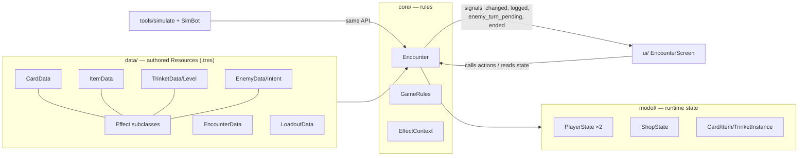
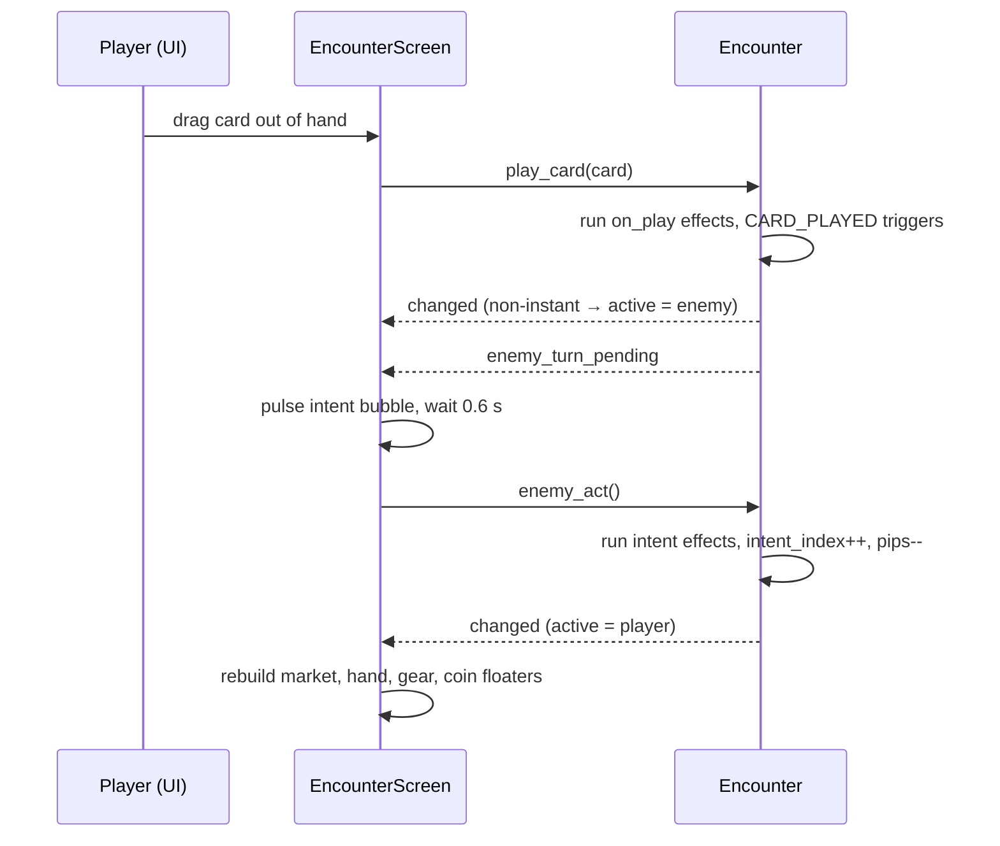

# Architecture

## Layers

**Key rule:** `Encounter` is **UI-agnostic**. The screen and the headless simulator drive it through the same public methods. The UI never changes state directly.

| Layer | Type | Lifetime | Mutated? |
|---|---|---|---|
| `data/` | `Resource` | Asset on disk | Never at runtime. It's shared, so treat it as read-only. |
| `model/` | `RefCounted` | One encounter | Yes, by `Encounter` only |
| `core/` | `RefCounted` | One encounter | Owns the model |
| `ui/` | `Control` nodes | Scene | Rebuilt from state on `changed` |

## Core classes

### `Encounter` (`core/encounter.gd`)

The whole rules engine. It's built with `Encounter.new(EncounterData, LoadoutData)`, then you call `start()`.

| Group | Members |
|---|---|
| State | `player`, `enemy` (`PlayerState`), `shop`, `rng`, `round_num`, `active`, `is_over`, `won`, `enemy_actions_left`, `last_bought_zone` |
| Queries | `is_player_turn`, `can_play`, `can_buy_card/item/trinket/enhancement`, `can_use_trinket`, `can_upgrade_trinket`, `current_intent`, `upcoming_intents(n)`, `rounds_left` |
| Player actions (return `bool`) | `play_card`, `buy_card`, `buy_item`, `buy_trinket`, `upgrade_trinket`, `buy_enhancement(slot, card)`, `use_trinket` (free), `pass_turn` |
| Enemy | `enemy_act()` resolves the current intent and hands the turn back |
| Helpers for effects | `change_coins`, `draw_cards`, `discard_random`, `add_card`, `text_vars`, `log_line` |

**Signals**

| Signal | When | Who listens |
|---|---|---|
| `changed` | After any state change | UI `_refresh()` |
| `logged(text)` | Each log line (BBCode) | UI log buffer |
| `enemy_turn_pending` | The enemy is about to act | UI starts a timer, then calls `enemy_act()`. The simulator calls it immediately. |
| `ended(won)` | After the last round | UI end overlay |

**Internal pipeline**

- `_ctx(owner, card)` builds an `EffectContext`.
- `_run(effects, ctx)` calls `apply(ctx)` on each effect and stops if the encounter is over.
- `_fire(trigger, player, ctx)` runs every item on that side whose `trigger` matches and whose limits allow it.
- `_finish_action(extra)` either passes control to the enemy (sets `active = enemy` and emits `enemy_turn_pending`) or returns it to the player.

### `EffectContext` (`core/effect_context.gd`)

This is what an effect sees: `encounter`, `owner`, `opponent`, `card`, `source_name` (for the log). Effects can also set two outputs: `buy_destination` and `grant_extra_action`. `resolve(target)` maps `SELF`/`OPPONENT` to a `PlayerState`.

### `GameRules` (`core/game_rules.gd`)

This holds the shared enums (`Target`, `Zone`, `Trigger`, `TrinketLimit`) and the rule constants. See [game-rules.md](game-rules.md#tunables--scriptscoregame_rulesgd).

## Model classes

| Class | Holds |
|---|---|
| `PlayerState` | `coins`, `draw_pile`, `hand`, `discard`, `in_play`, `items`, `trinkets`, stats (`cards_drawn_this_turn`, `cards_played_this_turn`, `buys_this_round`, `cards_bought`), enemy-only `intent_index`. `all_cards()` returns every card. |
| `ShopState` | Slot arrays `cards/items/trinkets/enhancements` (`null` = empty) and private shuffled bags. Methods: `setup`, `restock`, `take_*`, `snatch_card(mode, rng)`. |
| `CardInstance` | One copy of a card: `uid` (unique, used by the hand to animate new cards), `data`, `enhancements`. It merges enhancement effects in `get_on_play()` and `is_instant()`. |
| `ItemInstance` | `uses_this_round`, `uses_this_encounter`, `can_trigger()`, `mark_used()` |
| `TrinketInstance` | `level` (an index into `data.levels`), `used`, `current_effects()`, `can_upgrade()`, `upgrade_cost()` |

## One action, end to end

## Conventions

- **Everything that's content is a Resource plus a list of `Effect`s.** A new mechanic means a new `Effect` subclass (see [extending.md](extending.md)).
- **Text is auto-generated from effects** unless the designer writes custom text.
- **Rendering is state-driven.** The UI rebuilds from state on every `changed`. Animations use throwaway "ghost" views on an FX layer, so rebuilding never breaks them.
- **Log lines are BBCode** with fixed colors: cards `#9ad7ff`, items `#7fe3d0`, trinkets `#ffd166`, enemy `#ff7f6a`.
- **RNG:** a single `Encounter.rng` covers shuffles, the market and random effects. Set `EncounterData.rng_seed ≠ 0` to make it reproducible.
