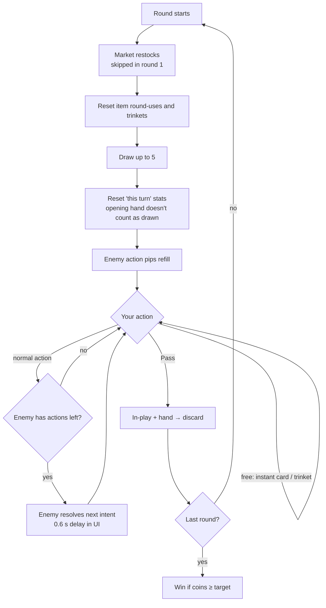

# Game Rules (as implemented)

What `scripts/core/encounter.gd` actually does. The tunables are listed at the end.

## Terminology

| Term | Meaning |
|---|---|
| **Encounter** | One shop plus one enemy, played over N **rounds** (default 3). |
| **Round = Turn** | Your whole round. You draw a hand, then act until you **Pass**. "This turn" in card text means this round. |
| **Action** | One thing you do. It's either **free** or **normal** (see below). |
| **Intent** | One scripted step of the enemy's pattern. The next one is always visible. |
| **In play** | Cards you played this round. They go to the discard pile at round end. |

## Goal

Have **coins ≥ `coin_target`** after the last round. If you win, `gold_reward` is shown. It isn't used yet because there's no run layer.

## Round flow

## Actions

| Free (the enemy doesn't respond) | Normal (the enemy responds if it has pips left) |
|---|---|
| Play an **instant** (⚡) card | Play a non-instant card |
| Use a **trinket** (once per turn each) | Buy a card, item, trinket or upgrade |
| | Upgrade a trinket |

- Which purchases count as actions is set by the `*_IS_ACTION` flags in `GameRules` (all `true` right now).
- An **extra action** effect (`ExtraActionEffect`) skips the enemy's response to that action.
- When the enemy runs out of actions for the round, you keep acting freely until you Pass.

## The enemy

- **It doesn't play cards or buy anything.** It walks through `EnemyData.intents` in order and loops back to the start. `start_intent` sets where it begins.
- **It answers each normal action with its next intent**, up to `actions_per_round` times per round (default 3). The pips on its panel show how many are left.
- It can start with **passive items**, which fire on triggers the same way yours do.
- It affects the market through intents such as `SnatchShopCardEffect`.
- Intent effects resolve with the **enemy as owner**, so `target = OPPONENT` means **you**.

## Market

| Row | Starting stock | Restock (start of each round after the first) |
|---|---|---|
| Cards | `card_slots` random picks from `card_pool` (duplicates make a card more likely) | **Every** card slot is rerolled |
| Items / Trinkets / Upgrades | Drawn from a shuffled "bag" of each pool (no repeats) | Only **empty** slots refill, from what's left in the bag |

- Buying **doesn't refill** the slot during the round. The legacy flag `refill_card_slots` changes that.
- If you can't afford something, it's shown dimmed and you can't drag it.

## Buying and playing, in order

**Buy a card:**
1. Pay the cost. The `BEFORE_CARD_BUY` trigger fires, and items can change where the card goes.
2. The card's **on-buy** effects resolve.
3. The card goes to its destination. By default it's **shuffled into the draw pile**, never your hand, unless something like Express Delivery says otherwise.
4. `CARD_BOUGHT` fires for you and `OPPONENT_CARD_BOUGHT` fires for the enemy. Then the enemy may respond.

**Play a card:** it leaves your hand → its on-play effects resolve (including any enhancement effects) → it goes **in play** → `CARD_PLAYED` / `OPPONENT_CARD_PLAYED` fire → the enemy may respond, unless the card is instant.

**Upgrade (enhancement):** pay, then pick a card **in your hand**. The upgrade attaches to that card instance: it adds on-play effects and/or makes the card instant, and the card's name gets a `+`.

## Deck mechanics

- **Hand size is 5.** At round start you draw up to 5.
- When the draw pile is empty, the **discard pile is shuffled** into a new draw pile. Cards **in play** aren't included, which prevents infinite draw loops within a round.
- At round end, in-play cards and your remaining hand go to the discard pile (`DISCARD_HAND_AT_ROUND_END`).
- Coins can never drop below 0. A steal only takes what the opponent has.

## Tunables — `scripts/core/game_rules.gd`

| Constant | Value | Effect |
|---|---|---|
| `HAND_SIZE` | 5 | Cards you draw up to each round |
| `DEFAULT_BUY_DESTINATION` | `DRAW_SHUFFLE` | Where bought cards go |
| `DISCARD_HAND_AT_ROUND_END` | true | Whether you keep unplayed cards between rounds |
| `TRINKET_LIMIT` | `PER_TURN` | `PER_ACTION` would reset trinkets after every action |
| `CARD/ITEM/TRINKET_BUY_IS_ACTION`, `TRINKET_UPGRADE_IS_ACTION`, `ENHANCEMENT_BUY_IS_ACTION` | all true | Whether each purchase uses an action (and lets the enemy respond) |
| `ENEMY_STEP_DELAY` | 0.6 s | UI pause before the enemy's intent resolves |

Per-encounter settings (rounds, target, slots, pools, seed) are in `EncounterData`. Per-enemy settings (`actions_per_round`) are in `EnemyData`. See [content-design.md](content-design.md).
