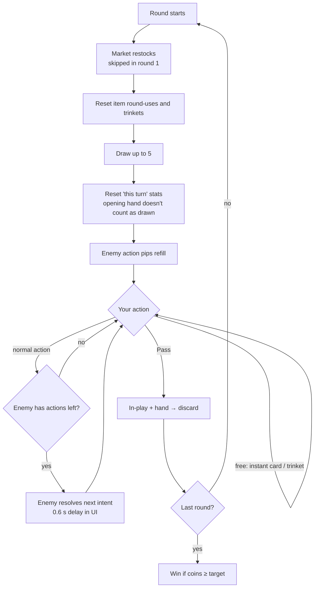

# Game Rules (as implemented)

What `scripts/core/encounter.gd` actually does. The tunables are listed at the end.

## Terminology

| Term | Meaning |
|---|---|
| **Encounter** | One shop plus one enemy, played over N **rounds** (default 3). |
| **Round = Turn** | Your whole round. You draw a hand, then act until you **Pass**. "This turn" in card text means this round. Effects can add extra rounds. |
| **Action** | One thing you do. It's either **free** or **normal** (see below). |
| **Intent** | One scripted step of the enemy's pattern. The next one is always visible. |

## Goal

Have **coins ≥ `coin_target`** after the last round. If you win, `gold_reward` is shown. It isn't used yet because there's no run layer.

## Round flow

```mermaid
flowchart TD
    A[Round starts] --> B[Market restocks<br/>skipped in round 1]
    B --> C[Reset item round-uses and trinkets]
    C --> D[Draw up to 5]
    D --> E[Reset 'this turn' stats<br/>opening hand doesn't count as drawn]
    E --> F[Enemy action pips refill]
    F --> G{Your action}
    G -- free: instant card / trinket --> G
    G -- normal action --> H{Enemy has actions left?}
    H -- yes --> I[Enemy resolves next intent<br/>0.6 s delay in UI] --> G
    H -- no --> G
    G -- Pass --> J[In-play + hand → discard]
    J --> K{Last round?}
    K -- no --> A
    K -- yes --> L[Win if coins ≥ target]
```

## Actions

| Free (the enemy doesn't respond) | Normal (the enemy responds if it has pips left) |
|---|---|
| Play an **instant** (⚡) card | Play a non-instant card |
| Use a **trinket** (once per turn each) | Buy a card, item, trinket (or its upgrade) or upgrade (enhancement) |
| **Sell** a trinket | |

- Which purchases count as actions is set by the `*_IS_ACTION` flags in `GameRules` (all `true` right now).
- An **extra action** effect (`ExtraActionEffect`) skips the enemy's response to that action.
- When the enemy runs out of actions for the round, you keep acting freely until you Pass.

## The enemy

- **It doesn't play cards or buy anything.** It walks through `EnemyData.intents` in order and loops back to the start. `start_intent` sets where it begins.
- **It answers each normal action with its next intent**, up to `actions_per_round` times per round (default 3). The pips on its panel show how many are left.
- It can start with **passive items**, which fire on triggers the same way yours do.
- It affects the market through intents such as `SnatchShopCardEffect`.
- Intent effects resolve with the **enemy as owner**, so `target = OPPONENT` means **you**.

## Market

| Row | Starting stock | Restock (start of each round after the first) |
|---|---|---|
| Cards | `card_slots` random picks from the card pool (duplicates make a card more likely) | **Every** card slot is rerolled |
| Items | Drawn from a shuffled "bag" of the item pool (no repeats) | Only **empty** slots refill, from what's left in the bag |
| Trinkets | A weighted pick from the trinket pool (no repeats on screen) | **Every** slot is rerolled |
| Upgrades (enhancements) | A pick from the enhancement pool (no repeats on screen) | **Every** slot is rerolled |

- Buying **doesn't refill** the slot during the round. The legacy flag `refill_card_slots` changes that.
- **What the pools contain:** an encounter lists its `card_sets`; it sells every card, item, trinket and enhancement of those sets **plus Utility and Coins** (`CardSets.ALWAYS_SOLD`). The manual `*_pool` fields are extras on top (see [content-design.md](content-design.md#card-sets)).
- **Price overrides:** an owned item with `card_price_override` (Needful: 0) sets the price of **every** market card (the lowest override wins). The tile shows the normal price struck through.
- If you can't afford something, it's shown dimmed and you can't drag it.

## Buying and playing, in order

**Buy a card:**
1. Pay the cost. The `BEFORE_CARD_BUY` trigger fires, and items can change where the card goes.
2. The card's **on-buy** effects resolve.
3. The card goes to its destination. By default it goes to the **bottom of the draw pile**, never your hand, unless something like Express Delivery says otherwise.
4. `CARD_BOUGHT` fires for you and `OPPONENT_CARD_BOUGHT` fires for the enemy. Then the enemy may respond.

**Play a card:** it leaves your hand → its on-play effects resolve (including any enhancement effects) → it goes to the **discard pile** → `CARD_PLAYED` / `OPPONENT_CARD_PLAYED` fire → the enemy may respond, unless the card is instant.

**Upgrade (enhancement):** pay, then pick a card **in your hand**. The upgrade attaches to that card instance: it can add on-play effects, make the card instant, retain it, return it when discarded or make it count as a curse, and the card's name gets a `+`. The Trim enhancement is the exception: it destroys the chosen card immediately (permanently) and attaches nothing.

## Trinkets: buy, upgrade, sell

- You can own at most **3 trinkets** (`GameRules.MAX_TRINKETS`). The Trinkets panel always shows 3 frames; the free ones are empty.
- The market has **1 trinket slot** and **1 item slot** (the default for every encounter). Trinket slots are **rerolled every round** from the whole pool, and trinkets you own (and can still upgrade) are **twice as likely**. A trinket you own at its top level never appears.
- **Buying a trinket you already own upgrades it** (no second copy). It costs the **next level's `upgrade_cost`**, and the market tile shows that next level in purple. **An upgrade also refreshes the trinket** (a used one can be used again this turn). A **new** trinket costs its base cost and needs a free slot, so with 3 trinkets it's greyed out.
- **Selling:** drag a trinket onto the market. You get **half of everything you paid for it** (purchase + upgrades), rounded down. It's a **free action** (`TRINKET_SELL_IS_ACTION = false`) and frees the slot.

## Choices

Some effects make you decide something while they resolve: pick cards to discard / remove / destroy / retain, pick one of two options ("X OR Y"), a market card, a trinket. Nothing else can happen until you answer.

- **Exactly N:** "Destroy 2" / "Remove 2" / "Discard 2" must pick 2 if possible, fewer only if there aren't enough cards. "You may…" and "any" are optional.
- **Unplayable costs:** a card whose cost can't be paid can't be played ("Pay 2 🪙 ➡", "Discard 1 ⤵ ➡" with no other card in hand). "All" effects work on zero ("Remove all other cards…" with an empty hand is fine).
- **Hidden order:** when you pick from your deck the cards are shown sorted, so the order isn't revealed. "Look at the top N" shows them in order.

## Remove, destroy, discard, retain

| Term | Meaning |
|---|---|
| **Remove** 🗑 | Out of the deck for this encounter (`PlayerState.removed`) |
| **Destroy** 🔥 | Out permanently (`PlayerState.destroyed`). Fires the card's `on_destroy`. |
| **Discard** ⤵ | From the hand to the discard pile, unless the text says otherwise. Fires `on_discard` and `CARD_DISCARDED`. The end-of-round cleanup is **not** a discard. |
| **Retain** | The card stays in your hand at the end of the turn. You then draw a **full** new hand of 5 on top of it. |
| **Refresh** ↺ | A used trinket can be used again this turn |

Remove and destroy pick from the deck, hand or discard pile unless stated otherwise.

## Curses

Curses are cards with `curse = true`, usually **unplayable**, and shown in dark red. They don't stay between encounters unless `permanent` (there's no run layer yet, so this is only a flag for now). The test curses (dummy names) are C1 Dead Weight (does nothing), C2 Barnacle (permanent), C3 Driftwood (playable as a normal action: removes itself) and C4 Leaky Purse (lose 2 🪙 at the end of your turn if it's in your hand).

## Pass, extra turns, playing extra cards

- **Pass** on a card ends your turn right after that action. The enemy doesn't answer it.
- An **extra turn** adds one more normal round to the encounter (restock, full hand, enemy actions refill).
- **Replays, copies and cards played from the deck all count as playing a card** (cards-played count and "when you play a card" items).

## Deck mechanics

- **Hand size is 5.** At round start you draw 5 from the **top** of the deck, on top of any retained cards, plus any "draw at the start of your next turn" bonus. If the deck has fewer cards you just draw what's there.
- **Cards you gain go to the bottom of the deck** (bought cards, curses, copies). Nothing is ever shuffled into the middle of the deck; only effects that say "on top of your deck" (e.g. Loan) put a card on top.
- **Played cards go straight to the discard pile** (after their on-play effects resolve, unless an effect moved them), so effects that look at the discard pile can see them. At the end of the turn the cards left in your hand go there too, except retained (📌) ones (`DISCARD_HAND_AT_ROUND_END`). Putting cards in the discard pile this way is not a "discard", so it fires no discard triggers.
- **At the end of every turn the whole discard pile is shuffled and put at the bottom of the deck.** The deck itself is never reshuffled. If the deck runs out in the middle of a turn, you just draw fewer cards (no reshuffle), which also stops infinite draw loops. The first deck order is shuffled once at the start of the encounter.
- Coins can never drop below 0. A steal only takes what the opponent has.

## Tunables — `scripts/core/game_rules.gd`

| Constant | Value | Effect |
|---|---|---|
| `HAND_SIZE` | 5 | Cards you draw up to each round |
| `DEFAULT_BUY_DESTINATION` | `DRAW_BOTTOM` | Where bought cards go |
| `DISCARD_HAND_AT_ROUND_END` | true | Whether you keep unplayed cards between rounds |
| `TRINKET_LIMIT` | `PER_TURN` | `PER_ACTION` would reset trinkets after every action |
| `CARD/ITEM/TRINKET_BUY_IS_ACTION`, `ENHANCEMENT_BUY_IS_ACTION` | all true | Whether each purchase uses an action (and lets the enemy respond). Buying a trinket duplicate (an upgrade) counts as a trinket buy. |
| `TRINKET_SELL_IS_ACTION` | false | Selling a trinket is free |
| `MAX_TRINKETS` | 3 | Trinket slots you can own |
| `ENEMY_STEP_DELAY` | 0.6 s | UI pause before the enemy's intent resolves |

Per-encounter settings (rounds, target, slots, pools, seed) are in `EncounterData`. Per-enemy settings (`actions_per_round`) are in `EnemyData`. See [content-design.md](content-design.md).
