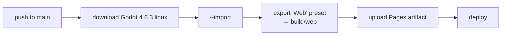

# Tools, Playtesting and Deploy

## Headless tools (`tools/`)

All of them run with `godot --headless --path . --script res://tools/<name>.gd -- <args>`.

| Tool | Args (defaults) | What it does |
|---|---|---|
| `simulate.gd` | `[encounter.tres] [loadout.tres] [runs]` (test encounter, test loadout, 200) | A greedy `SimBot` plays the player side N times. It prints the win %, average final coins and enemy actions per encounter. |
| `build_test_content.gd` | — | Rewrites everything in `content/test/` from code |
| `serve_web.gd` | `[port]` (8443) | A tiny HTTPS static server for `build/web`, using a self-signed certificate |

Output format:

```
<encounter>: <runs> runs | bot win <N>% | avg final coins <X> (target <T>) | enemy acts/encounter <Y>
```

### SimBot (`scripts/sim/sim_bot.gd`)

Each step, the bot does the following:

1. Uses every trinket and instant card with a positive score.
2. Picks the best of: playing a card (`score_list(on_play)`), or buying a card (`on_buy + on_play × future × 1.5 − cost × 0.6`, where `future` is how many rounds are left).
3. Passes if nothing beats `MIN_VALUE` (0.25). It buys at most 4 cards per round.

It never buys items, trinkets or upgrades, so **treat its win rate as a floor**. For reproducible runs, set `rng_seed` on the encounter.

## Playtesting on a phone

### Option A: GitHub Pages (from anywhere)

Every push to `main` runs `.github/workflows/deploy-web.yml`:



- The Web export template is **bundled** (`export_templates/web_nothreads_release.zip`, single-threaded), so the CI only downloads Godot.
- One-time setup: go to repo **Settings → Pages → Source: GitHub Actions**, then run the workflow once by hand.
- On the phone: open the link → turn it sideways → tap **Fullscreen**.

### Option B: same Wi-Fi (`playtest_mobile.bat`)

1. Double-click it, or drag your Godot `.exe` onto it. It also checks the `GODOT` env var and `PATH`, and prefers the `_console` build.
2. It exports to `build/web`, then runs `serve_web.gd` on port 8443 and prints `https://<lan-ip>:8443`.
3. On the phone, accept the self-signed certificate warning. HTTPS is required because Godot web builds need a secure context.

## Export preset (`export_presets.cfg`)

| Setting | Value |
|---|---|
| Preset | `Web` → `build/web/index.html` |
| Excluded | `tools/*`, `build/*`, `export_templates/*` |
| Threads / extensions | off (no cross-origin isolation needed) |
| Viewport meta | `user-scalable=no` |
| Canvas resize | adaptive |

## Upgrading Godot

1. Update `GODOT_VERSION` in the workflow.
2. Replace the bundled template zip with the matching version (Editor → Manage Export Templates).
3. Update the version names in `playtest_mobile.bat`, and `config/features` in `project.godot`.

## Git notes

- `.gitignore` excludes `.godot/`, `build/`, `/android/` and `_to_delete/`.
- `.gitattributes` uses LF everywhere, CRLF for `.bat`, and treats `.zip` as binary.
- `*.gd.uid` files **are** committed. They keep resource references stable.
- After adding a new `class_name`, open the project in the editor (or run `--import`) so `.godot/global_script_class_cache.cfg` is refreshed. Headless runs fail to parse without it.
