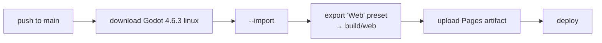

# Tools, Playtesting and Deploy

## Headless tools (`tools/`)

All of them run with `godot --headless --path . --script res://tools/<name>.gd -- <args>`.

| Tool | Args (defaults) | What it does |
|---|---|---|
| `simulate.gd` | `[encounter.tres] [loadout.tres] [runs]` (test encounter, test loadout, 200) | A greedy `SimBot` plays the player side N times. It prints the win %, average final coins and enemy actions per encounter. |
| `build_test_content.gd` | — | Rewrites the cards, items, trinkets, curses, TEST enemy / encounter and loadout in `content/test/` from code, and applies the card-set map (`SETS`). **Careful:** several `.tres` texts were edited by hand afterwards (Rush Order, Cursed Luck, Furnace, Incinerator, Rebate, Scrap Dealer), and the script still has the old wording, so re-running it overwrites those edits and drops the `uid`s of the hand-made originals. Restore them from git afterwards, or sync the script first. |
| `build_enhancements.gd` | — | Rewrites `content/test/enhancements/` (one enhancement per card set). Safe to re-run: it only touches that folder. |
| `build_encounters.gd` | — | Rebuilds the 5 themed encounters + their enemies and the Toll passive. Each encounter lists its `card_sets` (and `enhancement_slots = 1`); the pools are not saved, they are resolved at runtime, so moving a piece to another set needs no re-run. Safe to re-run (it doesn't touch cards). |
| `test_mechanics.gd` | — | Rules tests: plays every card, item and trinket level, then checks specific rules (costs, choices, retain, pass, extra turn, curses, items). Prints FAILs and a summary; exit code 1 on failure. |
| `serve_web.gd` | `[port]` (8443) | A tiny HTTPS static server for `build/web`, using a self-signed certificate |

Output format:

```
<encounter>: <runs> runs | bot win <N>% | avg final coins <X> (target <T>) | enemy acts/encounter <Y>
```

### SimBot (`scripts/sim/sim_bot.gd`)

Each step, the bot does the following:

1. Uses every trinket and instant card with a positive score.
2. Picks the best of: playing a card (`score_list(on_play)`), or buying a card (`on_buy + on_play × future × 1.5 − cost × 0.6`, where `future` is how many rounds are left).
3. Passes if nothing beats `MIN_VALUE` (0.25). It buys at most 4 cards per round.

It answers choices with `SimBot.choose` (gets rid of curses / weakest cards, keeps the best). It never buys trinkets or upgrades and rarely buys items, so **treat its win rate as a floor**. For reproducible runs, set `rng_seed` on the encounter.

## Content browser (editor plugin)

`addons/content_browser/` adds the **Content** main-screen tab (enabled in `project.godot`; if it's missing, turn it on in **Project → Project Settings → Plugins**). See [content-design.md](content-design.md) for what it does. Notes:

- It builds its edit panel from each resource's exported properties, so new fields, enums and effect types appear without changing the plugin. Arrays of resource classes listed in `REF_DIRS` (cards, items, trinkets, enhancements, enemies, encounters) are edited as references; any other resource array (effects, `EffectOption`, `TrinketLevel`, `EnemyIntent`) is edited inline, and **+ Add** offers every `class_name` that extends the element type.
- The content scripts aren't `@tool`, so in the editor their methods can't run. Tiles show your custom text as written; when a text field is empty, the tile shows an `auto:` summary of the effects instead of the game's generated wording.
- Edits are written with `ResourceSaver`, so a file gets re-serialized in Godot's normal format the first time you edit it (expect some reordering in the git diff).
- Files changed outside the editor (git, a text editor, the generator scripts) are reloaded when you switch back to the tab, or with **Reload from disk**.
- The **Sets** tab edits `scripts/data/card_sets.gd` through `card_sets_file.gd`: it rewrites only the `enum Id`, `_INFO` and `ALWAYS_SOLD` blocks and leaves the rest of the file alone. After a save it recompiles `CardSets` and the data scripts that export `CardSets.Id`, so the Inspector's set menus pick up a new set without restarting the editor.
- Excluded from the web export (`export_presets.cfg`).

## Playtesting on a phone

### Option A: GitHub Pages (from anywhere)

Every push to `main` runs `.github/workflows/deploy-web.yml`:


```mermaid
flowchart LR
    P[push to main] --> D[download Godot 4.6.3 linux] --> I[--import] --> X[export 'Web' preset<br/>→ build/web] --> U[upload Pages artifact] --> DEP[deploy]
```

- The Web export template is **bundled** (`export_templates/web_nothreads_release.zip`, single-threaded), so the CI only downloads Godot.
- One-time setup: go to repo **Settings → Pages → Source: GitHub Actions**, then run the workflow once by hand.
- On the phone: open the link → turn it sideways → tap **Fullscreen**.

### Option B: same Wi-Fi (`playtest_mobile.bat`)

1. Double-click it, or drag your Godot `.exe` onto it. It also checks the `GODOT` env var and `PATH`, and prefers the `_console` build.
2. It exports to `build/web`, then runs `serve_web.gd` on port 8443 and prints `https://<lan-ip>:8443`.
3. On the phone, accept the self-signed certificate warning. HTTPS is required because Godot web builds need a secure context.

## Export preset (`export_presets.cfg`)

| Setting | Value |
|---|---|
| Preset | `Web` → `build/web/index.html` |
| Excluded | `tools/*`, `build/*`, `export_templates/*` |
| Threads / extensions | off (no cross-origin isolation needed) |
| Viewport meta | `user-scalable=no` |
| Canvas resize | adaptive |

## Upgrading Godot

1. Update `GODOT_VERSION` in the workflow.
2. Replace the bundled template zip with the matching version (Editor → Manage Export Templates).
3. Update the version names in `playtest_mobile.bat`, and `config/features` in `project.godot`.

## Git notes

- `.gitignore` excludes `.godot/`, `build/`, `/android/` and `_to_delete/`.
- `.gitattributes` uses LF everywhere, CRLF for `.bat`, and treats `.zip` as binary.
- `*.gd.uid` files **are** committed. They keep resource references stable.
- After adding a new `class_name`, open the project in the editor (or run `--import`) so `.godot/global_script_class_cache.cfg` is refreshed. Headless runs fail to parse without it.
